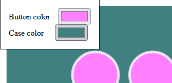

# Snackbox Micro visualizer

This is a simple input overlay for [Junkfood Arcades Snackbox Micro](https://junkfoodarcades.com/collections/snack-box-micro).

You can try it directly here : [snackbox-micro-visualizer.netlify.app](https://snackbox-micro-visualizer.netlify.app)

## How to use with OBS

In OBS, add a _Browser_ source and use this URL : `https://snackbox-micro-visualizer.netlify.app/`. That's it !

You can change the opacity of the overlay by adding a _Color adjustment_.

## How to customize colors

Go to the [app page](https://snackbox-micro-visualizer.netlify.app) and hover your mouse over the top left corner.

Once you have chosen your prefered colors, copy the URL from the adress bar and use it in your streaming software. It should look like this `https://snackbox-micro-visualizer.netlify.app/?buttonColor=%23ff80ff&caseColor=%23408080`
